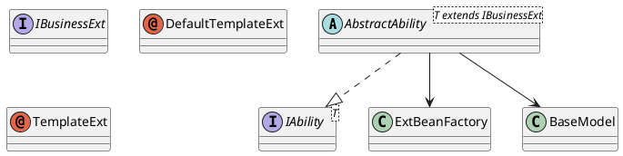

# 🚀 Easy-SPI

> **约束业务的不是你，是框架。**

> **拒绝面条式代码，从拒绝业务的if-else开始。**

---

## 📌 核心目标

在多业务场景下，拒绝面条式 `if-else` 路由。  
**Easy-SPI** 用最小侵入的注解驱动机制，帮你把扩展点注册、路由、回退托管给框架。  
业务隔离，主干纯净，场景随时可插拔，**扩展像插件一样生长**。

---

## ⚙️ 简介

### 你是否遇到过这些场景：

- 🚩 多业务多场景，if-else 套娃，维护崩溃。
- 🚩 新增场景只能复制粘贴，再加 if-else。
- 🚩 一改路由逻辑，老业务埋雷。

### Easy-SPI 的态度：

- ❌ 业务里不写路由。
- ✅ 路由交给注解，注册交给容器，动态匹配交给框架。
- ✅ 无匹配自动回退，扩展点天然解耦。
- ✅ Spring Boot 无缝集成，一行配置即接入。

---

## 🧩 特性

- **极简注解**：`@TemplateExt` + `@DefaultTemplateExt`，声明即注册。
- **动态路由**：基于 `bizCode` + `scenario` 「业务 x 场景」两层结构的自动匹配最优扩展。
- **默认回退**：未命中兜底，防止漏配。
- **低侵入**：无需重构老代码，能力即插即用。
- **Spring原生**：一行 `@ComponentScan`，自动装配。

---

## ⚡️ 快速开始

### 1️⃣ Maven 引入

```xml
<dependency>
  <groupId>io.github.sumo1</groupId>
  <artifactId>easy-spi</artifactId>
  <version>1.0.0</version>
</dependency>
```

---

### 2️⃣ Spring 启用

```java
@Configuration
@ComponentScan("io.github.easyspi")
public class EasySpiConfig {}
```

---

### 3️⃣ 定义默认扩展

```java
@DefaultTemplateExt
public class DefaultExt implements IBusinessExt {
    // 默认实现
    public void doSomething();
}
```

---

### 4️⃣ 定义自定义扩展

```java
@TemplateExt(bizCode = "bizcodeA")
public class BizcodeExt extends DefaultExt {
    // 覆盖默认
    public void doSomething();
}
```

```java
@TemplateExt(bizCode = "bizcodeA", scenario = "morning")
public class BizcodeAndScenarioExt extends DefaultExt {
    // 覆盖默认
    public void doSomething();
}
```

---

### 5️⃣ 定义能力类

```java
@DefaultTemplateExt
public class FooAbility extends AbstractAbility<DefaultExt> {
    public String exec(BaseModel model) {
        return execute(model, ext -> ext.doSomething());
    }
}
```

---

### 6️⃣ 调用

```java
@Autowired
private FooAbility fooAbility;

String result = fooAbility.exec(BaseModel.valueOf("bizcodeA", "morning"));
```

---

## 🗂️ 路由 & 回退规则

| 输入 | 优先匹配 | 回退 | 默认 | 命中示例 |
|------|----------|------|------|----------|
| `bizCode#scenario` | ✅ |      |      | BizcodeAndScenarioExt |
| `bizCode` | 🚑 |      |      | BizcodeExt |
| 无匹配 |      |      | ✅ | DefaultExt |

---

## ⚙️ 内核类图



---

## 🧪 典型测试
```java
@DefaultTemplateExt
public class TestAbility extends AbstractAbility<DefaultTestAbilityExt> {

    public String executorSPI(BaseModel model) {
        return execute(model, ext -> ext.getName());
    }
}
```

```java
@DefaultTemplateExt
public class DefaultTestAbilityExt implements IBusinessExt {

    public String getName() {
        return "DefaultTestAbilityExt";
    }

}
```

```java
@TemplateExt(bizCode = "modelA")
public class ModelAExt extends DefaultTestAbilityExt {

    @Override
    public String getName() {
        return "ModelAExt";
    }

}
```

```java
@TemplateExt(bizCode = "modelA", scenario = "scenarioA")
public class ModelAWithScenario extends DefaultTestAbilityExt {

    @Override
    public String getName() {
        return "ModelAWithScenario";
    }

}
```

```java
@TemplateExt(bizCode = "modelB")
public class ModelBExt extends DefaultTestAbilityExt {

    @Override
    public String getName() {
        return "ModelBExt";
    }

}
```

```java
@Test
    public void testDefaultExtensionRegistrationAndExecution() {
        String result = ability.executorSPI(null);
        Assert.assertEquals("DefaultTestAbilityExt", result);
    }

    @Test
    public void testCustomExtensionWithBizCode() {
        BaseModel model = BaseModel.valueOf("modelA");
        String result = ability.executorSPI(model);
        Assert.assertEquals("ModelAExt", result);
    }

    @Test
    public void testCustomExtensionWithBizCode2() {
        BaseModel model = BaseModel.valueOf("modelB");
        String result = ability.executorSPI(model);
        Assert.assertEquals("ModelBExt", result);
    }

    @Test
    public void testCustomExtensionWithScenario() {
        BaseModel model = BaseModel.valueOf("modelA", "scenarioA");
        String result = ability.executorSPI(model);
        Assert.assertEquals("ModelAWithScenario", result);
    }

    @Test
    public void testCustomExtensionWithScenarioFallback() {
        BaseModel model = BaseModel.valueOf("modelA", "scenarioB");
        String result = ability.executorSPI(model);
        Assert.assertEquals("ModelAExt", result);
    }

    @Test
    public void testFallbackToDefault() {
        BaseModel model = BaseModel.valueOf("nonExistentBiz");
        String result = ability.executorSPI(model);
        Assert.assertEquals("DefaultTestAbilityExt", result);
    }

    @Test
    public void testExecuteVoid() {
        final String[] result = new String[1];
        ability.executeVoid(null, ext -> result[0] = ext.getName());
        Assert.assertEquals("DefaultTestAbilityExt", result[0]);
    }
```

---

## 🤝 贡献

Fork & PR 即刻生效，协作简单粗暴。

---

## ⚖️ License

MIT

---

## 🏁 End