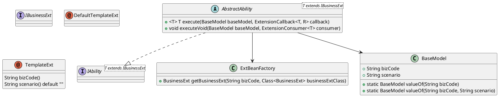

# Easy-SPI

一个轻量级Spring SPI扩展框架，简化业务动态扩展。

## 介绍

你是否面临类似的场景：在开发业务系统中，为了处理不同业务代码（bizCode）或场景（scenario）的变异逻辑，不得不使用层层嵌套的if-else语句，导致代码维护困难、扩展性差？

那么，你可以使用Easy-SPI框架，它用不到10行注解代码，解决了if-else的面条式代码在扩展性和维护上的痛点，通过注解驱动（如@DefaultTemplateExt和@TemplateExt）实现自动扩展点注册和动态选择，避免了硬编码逻辑的复杂性和注入失败问题。

它足够轻量、简单、侵入性低，还具有默认扩展回退、精准场景匹配、Spring无缝集成等特性，帮助你高效管理业务扩展。

## 特性

- **注解驱动**：使用@TemplateExt和@DefaultTemplateExt轻松定义扩展点。
- **动态选择**：根据BaseModel的bizCode和scenario自动选择合适的扩展实现。
- **默认回退**：无匹配时自动使用默认扩展。
- **Spring集成**：无缝集成Spring Boot，自动配置ExtBeanFactory。
- **轻量级**：最小化依赖，易于集成。

## 安装

添加Maven依赖：

```xml
<dependency>
    <groupId>com.my</groupId>
    <artifactId>easy-spi</artifactId>
    <version>1.0.0</version>
</dependency>
```

在Spring配置中启用：

```java
@Configuration
@ComponentScan("com.my.easyspi")
public class YourConfig {}
```

## 使用示例

1. 定义默认扩展：

```java
@DefaultTemplateExt
public class DefaultYourExt implements IBusinessExt {
    // 实现方法
}
```

2. 定义自定义扩展：

```java
@TemplateExt(bizCode = "yourBiz", scenario = "yourScenario")
public class CustomExt extends DefaultYourExt {
    // 覆盖方法
}
```

3. 定义能力类：

```java
@DefaultTemplateExt
public class YourAbility extends AbstractAbility<DefaultYourExt> {
    public String executeSPI(BaseModel model) {
        return execute(model, ext -> ext.yourMethod());
    }
}
```

4. 在测试或服务中使用：

```java
@Autowired
private YourAbility ability;

String result = ability.executeSPI(BaseModel.valueOf("yourBiz", "yourScenario"));
```

### 测试目录示例

以下是test目录中的实际使用示例，展示了如何定义能力类、默认扩展、自定义扩展以及在测试类中调用。

1. **默认扩展** (DefaultTestAbilityExt.java)：

```java
package com.my.easyspi.ext;

import com.my.easyspi.DefaultTemplateExt;
import com.my.easyspi.IBusinessExt;

@DefaultTemplateExt
public class DefaultTestAbilityExt implements IBusinessExt {

    public String getName() {
        return "DefaultTestAbilityExt";
    }

}
```

2. **自定义扩展** (ModelAExt.java)：

```java
package com.my.easyspi.ext;

import com.my.easyspi.TemplateExt;

@TemplateExt(bizCode = "modelA")
public class ModelAExt extends DefaultTestAbilityExt {

    @Override
    public String getName() {
        return "ModelAExt";
    }

}
```

3. **能力类** (TestAbility.java)：

```java
package com.my.easyspi.ability;

import com.my.easyspi.AbstractAbility;
import com.my.easyspi.DefaultTemplateExt;
import com.my.easyspi.ext.DefaultTestAbilityExt;
import com.my.easyspi.meta.BaseModel;

@DefaultTemplateExt
public class TestAbility extends AbstractAbility<DefaultTestAbilityExt> {

  public String executorSPI(BaseModel model) {
    return execute(model, ext -> ext.getName());
  }
}
```

4. **测试类** (EasySpiCoreTest.java)：

```java
package com.my.easyspi;

import org.junit.Assert;
import org.junit.Test;
import org.junit.runner.RunWith;
import org.springframework.beans.factory.annotation.Autowired;
import org.springframework.test.context.ContextConfiguration;
import org.springframework.test.context.junit4.SpringRunner;

import com.my.easyspi.ability.TestAbility;
import com.my.easyspi.meta.BaseModel;

@RunWith(SpringRunner.class)
@ContextConfiguration(classes = {EasySpiBeanAutoConfig.class})
public class EasySpiCoreTest {

    @Autowired
    private TestAbility ability;

    @Test
    public void testDefaultExtensionRegistrationAndExecution() {
        String result = ability.executorSPI(null);
        Assert.assertEquals("DefaultTestAbilityExt", result);
    }

    @Test
    public void testCustomExtensionWithBizCode() {
        BaseModel model = BaseModel.valueOf("modelA"); // 修改为匹配的bizCode
        String result = ability.executorSPI(model);
        Assert.assertEquals("ModelAExt", result);
    }
    // 更多测试...
}
```

这些示例演示了框架在测试环境中的实际应用。

## 路由和回退逻辑

Easy-SPI根据BaseModel的bizCode和scenario动态检索扩展点。检索顺序如下（基于项目测试示例）：

| 输入BizCode | 输入Scenario | 检索Key 1 (优先: bizCode#scenario) | 检索Key 2 (回退: bizCode) | 检索Key 3 (默认) | 预期命中扩展 |
|-------------|--------------|------------------------------------|---------------------------|------------------|-------------|
| modelA     | scenarioA   | modelA#scenarioA                  | modelA                   | EASY-SPI-DEFAULT | ModelAWithScenario |
| modelA     | scenarioB   | modelA#scenarioB                  | modelA                   | EASY-SPI-DEFAULT | ModelAExt |
| modelB     | (空)        | (跳过)                            | modelB                   | EASY-SPI-DEFAULT | ModelBExt |
| nonExistent| scenarioX   | nonExistent#scenarioX             | nonExistent              | EASY-SPI-DEFAULT | DefaultTestAbilityExt |
| (空)       | (空)        | (跳过)                            | (跳过)                   | EASY-SPI-DEFAULT | DefaultTestAbilityExt |

### 检索流程

1. **如果scenario不为空**：首先尝试检索`bizCode#scenario`对应的扩展。
   - 如果找到，则使用它。
   - 如果未找到，继续下一步。
2. **回退到bizCode**：尝试检索`bizCode`对应的扩展（忽略scenario）。
   - 如果找到，则使用它。
   - 如果未找到，继续下一步。
3. **默认回退**：使用默认扩展（EASY-SPI-DEFAULT）。

此逻辑确保了灵活性和容错性，避免无扩展可用时失败。

## 类图

以下是Easy-SPI核心类图（使用PlantUML表示）：



## 贡献

欢迎贡献！请fork仓库，提交PR。

## 许可证

MIT License 